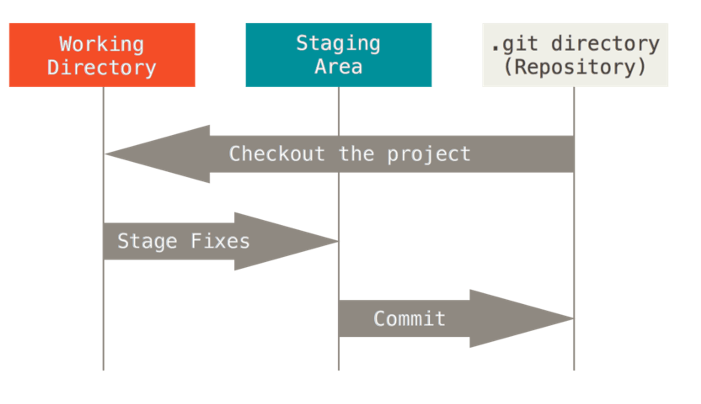

**This sessions combines:**

1. [A powerpoint presentation](TODO - add link).
2. A hands on session where we can refer to this document for tips and some code blocks that we can copy-paste.

There'll be a little bit of switching back and forth between the presentation and hands on, but we'll begin with the powerpoint.

## Hands on Session - Part 1, Git.

As we have now discussed in [the powerpoint](TODO - add link), Git is a version control system used to track changes in source code (or other files). It enables multiple people to work on the same project simultaneously and (somewhat) independently.


### Part 1.1 - Install Git and Create a GitHub Account
**useful links:**

- [Download git](https://git-scm.com/downloads) - select the right option for your OS.
- [Sign up to GitHub](https://github.com/join)

### Part 1.2 - Set up Git

Now we'll set some default settings for git, open up git in the command line and add these code blocks.

**Recommendation: Set your user.name to your github user name.**
```
git config --global user.name "Your User Name"
```

**Recommendation: Set your user.email to: "[your git hub user name]@users.noreply.github.com".**
```
git config --global user.email yourname@example.com
```

```
git config --global init.defaultBranch main
```

**Optional extra setting:**

Set the default text editor to use with git. You'll make use of this text editor when you for example write commit messages. I like to use vscode (you'll need to have it installed), you can choose something else or skip this step if you like.
```
git config --global core.editor "[your text editor here] -w"
```

[It doesn't matter but by adding `-w` we tell Git to wait for the code editor to force Git to wait your commit message that you would type on your custom editor.](https://stackoverflow.com/questions/9725160/aborting-commit-due-to-empty-commit-message#:~:text=When%20you%20set%20an%20editor%20in%20the%20configuration%20of%20Git%2C%20make%20sure%20to%20pass%20the%20parameter%20%22%2Dw%22%20to%20force%20Git%20to%20wait%20your%20commit%20message%20that%20you%20would%20type%20on%20your%20custom%20editor.)

**You can confirm these commands worked by doing:**

```git config --list --show-origin```


### Part 1.3 - Create a New Git Repository
Now we'll create a local Git repository to get a feel for how things work:

First, we'll make a folder for our recipe and then initiate the repository:

```
mkdir recipe
cd recipe
git init -b main
```

Note: The "-b" flag in the git init command is short for: "--initial-branch". We set this to main. This is a standard (you may also see "master") sometimes. You don't have to set your initial branch to either of these names, but you should.

Now run:

```
git status
```

This command gives a report on the current status of our repository. Think back to the picture we saw in the presentation:


<sub><sup>Image from the Pro Git Book: https://git-scm.com/book/en/v2/Getting-Started-What-is-Git%3F</sup></sub>

The git status command will tell us where our different files are at in these steps. Of course, now we have no files.

### Part 1.4 - Make our First Commit

Lets make a file inside our folder called "the_best_programming_language.txt" and add your favorite programming language inside the file.

Run the ```git status``` command again, what's changed?

Go one step further and stage the change using "git add":
```git add the_best_programming_language.txt```

Now run the ```git status``` command again, what stage is the file at now?

Finally, lets commit the file using:
```git commit```
or
```git commit -m "Added a file on the best programming language in the world" ```

The -m stands for message, and is the message you write to explain what it is you have done since the last commit,(i.e., what files have you added and what have you done with them).

What do you see now if you run git status one more time?

**Recap: the commands we've seen so far are:**

- ```git status``` : report
- ```git add [files to add]``` add file(s) to the staging area
- ```git commit``` commit the files from staging area.


### Part 1.5 - Make our 2nd and 3rd Commits

Together, lets make two new commits, **use git status as often as you need to check your on the right track.**

1. For the first new commit, lets create a file called "top_3_animals.txt" and add **only your favorite** animal to the file. Add this file, commit it and make sure your commit message includes an explanation for what you've done.

2. For the second commit, update the file called "top_3_animals.txt" to add the remaining two animals to the file.


### Part 1.6 - Looking at the Commit History

We can use the git log command to see the commits made to the repository (in reverse order). Each commit has a hash which provides a unique label for the commit.

Test out the following versions of git log:

```
git log # standard
git log --oneline # summary version
git log --stat # more detailed
```

Note: Git has a lot of functionality to compare commits (see how the files have changed between commits) or files waiting to be commited (see command: ```git diff```). That said, it's normally easier to do this in your code editor, so we'll skip it for now, [click here for a tutorial on it.](https://git-scm.com/book/en/v2/Git-Basics-Recording-Changes-to-the-Repository#:~:text=Viewing%20Your%20Staged%20and%20Unstaged%20Changes)


### Part 1.7 - Good Commit Messages

An example good commit message:

```
Change plot line colours for all graphs

Change performed because prior colour palette was bad for colour blind people
```

The top line is the title of the commit and should provide a summary. Then a blank space is given before the body is written which provides more details if useful (some commits don't need a body). You don't need to include things like the file names of files you changed as it's already stored in the commit, see for example: ```git log --stat```.


### Part 1.8 - Summary so far:

You saw after setup we used the same set of commands repeatedly to make commits:

```
git status
git add [files to add]
git commit
```

When working on just a local repository by yourself this is pretty much all you need.
after the next powerpoint will focus on incorporating GitHub (a remote repository for your work) into our workflow.

Back to the powerpoint...


## Hands on Session - Part 2, GitHub and Git Combined


### Part 2.1, Make it easy to connect with GitHub via Git

[To do this we'll follow a short pre-existing tutorial on exactly that.](https://coderefinery.github.io/installation/ssh/). Follow the steps for SSH setup.


### Part 2.2, Make a new repository with GitHub

Using GitHub to create the repository can be quite useful as you can get some useful files for free:

- README - this will be displayed on the front page of the repository making it a great place to put notes for you or others
- .gitignore - Language specific .gitignore files with plenty of file extensions you wont want to upload to GitHub.
- License - A license file for your project (if you're not sure what license to pick when you create the code, you can always add it later).

Now use github to make a new repository, make sure to add a README file, .gitignore (specific for the programming language you use) and License (don't worry about which one you pick).


Once made, it should look like something like this:


Note that we can upload files and edit files directly with GitHub.


### Part 2.3, Make a commit on GitHub
It's quite rare to do this (perhaps except for updating README files), but lets use GitHub to make a commit.

We'll update the README with some more text. Click on the README file and then click on the pencil in the top left corner of the document to enter edit mode.

The README file is a [markdown](https://docs.github.com/en/get-started/writing-on-github/getting-started-with-writing-and-formatting-on-github/basic-writing-and-formatting-syntax) file, with extension ".md". This allows you to easily format the document, [see this GitHub guide on markdown](https://docs.github.com/en/get-started/writing-on-github/getting-started-with-writing-and-formatting-on-github/basic-writing-and-formatting-syntax). This document is also written using markdown.

**Task:** Update the README using GitHub with some markdown formatted content, include some bullet points, an extra title and some texts in bold.

**Tip:** Regularly swap between the edit and preview modes to check you're formatting correctly.


### Part 2.4, Make a local copy of the GitHub Repo

As we covered in the powerpoint, the GitHub repository is a "remote" version of the project.

To make a local copy we'll need to clone it. Use the SSH option that we setup in Part 2.1


Then in a terminal do:

```
git clone [repository to clone, copied from the picture above]
cd test-repo
ls -alh
```

If you get a error about SSH keys not being setup, go back to the tutorial on 2.1 and make sure it is setup correctly.
By running the `ls -alh` command we can see the files in this newly created folder include a `.git` folder. We can also run a `git status` command to see the current state of the repository.

Finally if we run the command:

```
git remote -v
```

You should see something like:

```
origin  git@github.com:RMCrean/test-repo.git (fetch)
origin  git@github.com:RMCrean/test-repo.git (push)
```

This essentially means we have the ability to push and pull (for now think of this and fetch as the same) commits from our local repo to our remote repo on GitHub. Let's do that.


### Part 2.5, Push a Local Change to the Remote Repository

Now we'll make a local commit and push this change to the remote repository on GitHub. Follow the same steps as you did for Part 1 (create/update file, add files to staging area, commit files). Once you're done run `git status`, you'll see something along these lines:

```
On branch main
Your branch is ahead of 'origin/main' by 1 commit.
```

Here origin/main refers to the remote (GitHub). As the message implies, we have changes (commits) we can "push" to GitHub. To do that run:

```
git push
```

Go take a look at the repository on GitHub, you should see the new changes now added.


### Part 2.6, Make a Remote Commit and "Pull" to update the Local Repository

Now lets do the reverse. Go to main page of your new GitHub repo and click on add file and either upload or add a new file directly.

Now if we run `git status` in our local repository it should say we are 1 commit behind, but instead we see:

To check for changes on the remote repository we need to first run:

```
git remote update
```

After this `git status` will correctly tell us we are 1 commit behind and we can pull the change using:

```
git pull
```

Now our local and remote versions are up to date again.


### Part 2 - Summary so far:

You saw after setting up the remote and local repositories we used the same two commands on top of the ones we already learned:

```
git push
git pull
```

For projects that you work on alone, that's not far from the truth

Back to the powerpoint...

## Hands on Session - Part 3, Branches and Merging

- **Recap: Branch** Branching lets you have different versions of a repository at one time. By default, your repository has one branch named `main` (sometimes called `master` instead) that is considered to be the definitive/central branch. Typically a branch is used to work on new features or bug fixes without affecting the main codebase until you are ready to merge the changes.

- **Recap: Merge** Merging combines changes from different branches into a single branch, typically changes are merged into the `main` branch.


### Part 3.1, TODO.

### Part 3.2, TODO.

### Part 3.3, TODO.

### Part 3.4, TODO.

### Part 3.5, TODO.

## Appendix

### Practical Tips:

- Where do I store my projects? I have a folder called projects close to the root folder of my pc (TODO - add picture). All projects get there own folder and I clone them to here.

- [Undoing things tutorial](ttps://git-scm.com/book/en/v2/Git-Basics-Undoing-Things)

- Use GitHub or something like VSCode to create your initial repository rather than Git directly. This will give you the chance to add things like .gitignore files and a License file.

- Use a .gitignore file to handle large data files or sensitive information you don't want to include. (As we saw, these can be created automatically when you make a repository with GitHub or VSCode, with good defaults for a project involving for example: python or R).


### Other Ways to Share Research Data
- GitHub (and it's equivalents) are not typically used to share large datasets (you can though), so use a .gitignore file to handle this.
- Raw research data, associated with a paper, especially large data files are probably better shared using a service like [Zenodo](https://zenodo.org/).
- Nothing wrong with having a GitHub repository and a Zenodo page for your project.


### Extra Reading/Watching:
- [Code refinery tutorial on git, highly recommended.](https://coderefinery.github.io/git-intro/)
- TODO

### GitHub Alternatives
As you hopefully now appreciate, you don't need to use GitHub to use Git. Alternative places to host remote repositories include for example [bitbucket](https://bitbucket.org/product/) and [GitLab](https://about.gitlab.com/) and they tend to offer very similar functionality.
