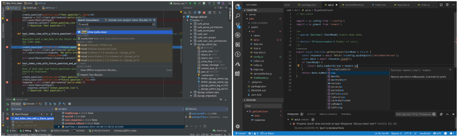

An integrated development enviroment (IDE) is an application that helps programmers develop software code efficiently. It increases developer productivity by combining capabilities such as software editing, building, testing, and packaging in an easy-to-use application. Just as writers use text editors and accountants use spreadsheets, software developers use IDEs to make their job easier.

For Python, there are 2 very popular IDEs, [PyCharm](https://www.jetbrains.com/pycharm/) (left) and [VSCode](https://code.visualstudio.com/) (right).

taken from: https://ritza.co/comparisons/pycharm-vs-spyder-vs-jupyter-vs-visual-studio-vs-anaconda-vs-intellij.html

Both are good choices but for this course we will focus on VSCode.

**[Click here to go to the VSCode download page](https://code.visualstudio.com/download)**

### After Installing VScode take a moment to look around and see what you can do with it.

### Extensions for VSCode
We will install the following extensions. 

- Python
- Pylance
- Pylint
- Jupyter
- isort
- black

To do this click on the extensions tab on the far left and search for the above extensions. 

** Optional addition:**
If you're using Windows subsystem for linux, install the "WSL" extension too. 

### Extra Reading/Watching:

- [VSCode Tips and Tricks](https://www.youtube.com/watch?v=fj2tuTIcUys)
- [VSCode Shortcuts](https://www.youtube.com/watch?v=dI34jrEtmB0)