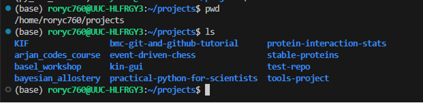

What is a good way to organize a project folder? That will naturally depend on the project but we can still try to follow some good practices. 

### Some generic tips:

**1. Using folders and subfolders to separate different parts of the project.**

Break parts of the project out into different sections where possible.
Don't have a single 


**2. Naming files in a way that is understandable for future you**

For example, don't write file names like: `try_1.py`, `this_works.py`, `updated_data.csv`

Consider how you will keep track of the files you produce. One common approach is to have a README file that describes the project and its parts. This is useful not just for others, but future you as well. 

**3. No spaces or non standard characters for files or folders**

Using spaces is in general a bad idea, use an `_` or `-` instead to separate out words in files and be consistent with what you use. I prefer `_` but this is up to you.

Avoid using characters like: `!?/\` in files names or folders. 


**4. New project, new folder**

It can be tempting to store all your projects inside the same place but this can end up being more messy than planned. 

Instead consider doing something like this:


In the above, I have an outer folder called `projects` which stores all of my different projects. So each project has its own folder. Inside the folder is the contents of the project. 

- If you decide to use Git for version control (discussed tomorrow) this setup will work well with that too. 
- Note in the setup above there are no spaces in the file path to any of these project folders. 


**5. Numbering folders inside project by order.** 
If we have a data processing pipeline made up of 5 steps, we could consider numbering each folder from for example 1 - 5. 

```
1_raw_data
2_filtered_data
3_normalized_data
4_models_fitted
5_model_description
```

Remember that this is just a suggestion. 

---

### Discussion time

Feel free to share any thoughts you have on what are good practices for projects? Or alternatively, things to avoid. 

---

### Further Reading

- [Cookiecutter Data Science Project Structure](https://drivendata.github.io/cookiecutter-data-science/). Described as: "A logical, reasonably standardized, but flexible project structure for doing and sharing data science work." In the description of this project template, it encourages you to adapt the project structure to your own needs. But it does provide a good starting point. 


