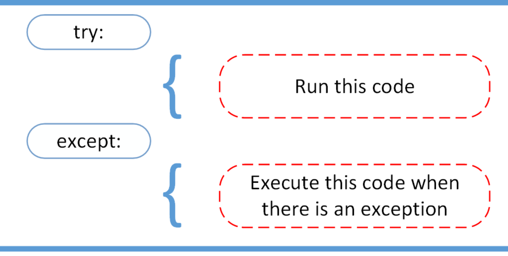
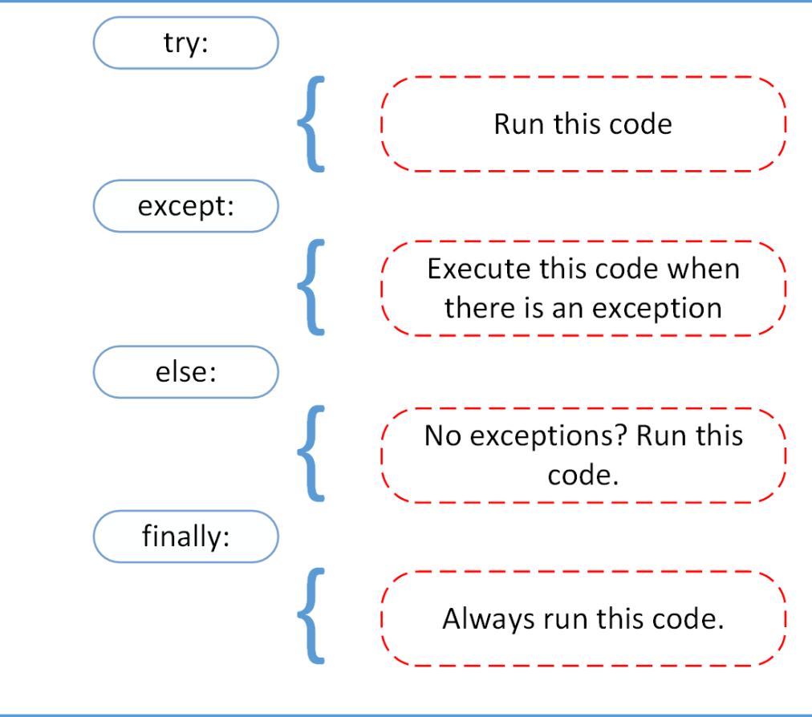

Exceptions happen when errors occur in our code. 


### The basics of try except


<sub><sup>Image taken from RealPython: https://realpython.com/python-exceptions/ </sup></sub>

```

```


---

### Things to avoid:

try:
except: 
pass # empty except..


```

```

---

### More settings: 


<sub><sup>Image taken from RealPython: https://realpython.com/python-exceptions/ </sup></sub>


```

```


---

### Further Reading

- [Try except tutorial with theory](https://realpython.com/python-exceptions/)
