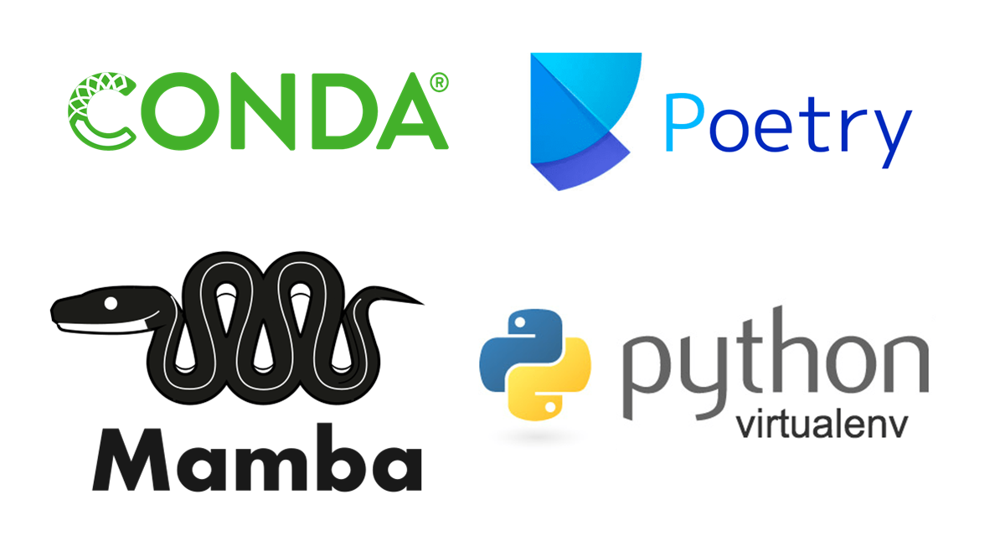
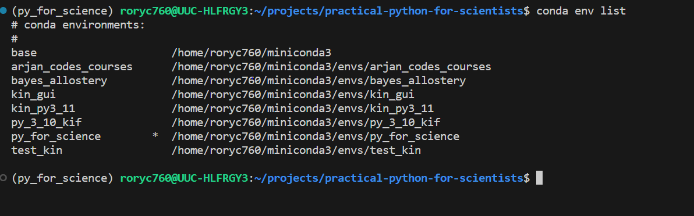

### What is a virtual enviroment? 
A virtual environment in Python is a self-contained directory or folder that allows you to create and manage isolated Python environments for your projects. With environments you can easy manage your dependencies and avoid conflicts with different versions of python.

**Virtual environments are used to:**

- Contain a specific Python interpreter and software libraries and binaries which are needed to support a project (library or application). These are by default isolated from software in other virtual environments and Python interpreters and libraries installed in the operating system.
- Contained in a directory, conventionally either named venv or .venv in the project directory, or under a container directory for lots of virtual environments, such as ~/.virtualenvs.
- Considered disposable – it should be simple to delete and recreate it from scratch. You don’t place any project code in the environment. 
- Not considered as movable or copyable – you just recreate the same environment in the target location. This is also means we don't share them with others, instead we tell them how to make the equivalent enviroment on their pc. 

Python has several ways to create and manage virtual enviroments: 



**The 4 most well known are shown in the picture above and are:**

- [conda](https://docs.conda.io/projects/conda/en/stable/)
- [Poetry](https://python-poetry.org/)
- [Mamba](https://mamba.readthedocs.io/en/latest/user_guide/mamba.html)
- [Virtualenv](https://virtualenv.pypa.io/en/latest/)

### Some practical considerations
1. Don’t worry too much about which of the above you use, just pick one. 
2. Rule of thumb: Each new project gets its own virtual environment

For the entiretiry of this course we'll use [conda](https://docs.conda.io/projects/conda/en/stable/). Conda comes in two versions: Anaconda, and Miniconda. Anaconda has a graphical user interface attached to it, Miniconda is just used through the command line. I prefer Miniconda but either is fine.  

### Installing Conda Instructions 
Follow the guides below. 

- [Windows](https://conda.io/projects/conda/en/latest/user-guide/install/windows.html)

- [Linux](https://conda.io/projects/conda/en/latest/user-guide/install/linux.html)

- [MacOS](https://conda.io/projects/conda/en/latest/user-guide/install/macos.html)

**Creating a Virtual Enviroment with Conda**
```
conda create -n environment_name python=3.11
conda activate environment_name
```

1. rename enviroment_name to something sensible for the given project. 

2. You'll know you've succesfully activated the enviroment if the enviroment name is shown in brackets before the terminal. 



### Installing programs 
[Let's look at an example from a one of Python's major libraries used to make graphs, plotly:](https://github.com/plotly/plotly.py#installation)

here we see options to use either conda and pip install. 


### Multi_installs. 
```
pip install numpy pandas
```

then show conda equivalent. 

[Finally, here's a cheatsheet on conda commands](https://docs.conda.io/projects/conda/en/4.6.0/_downloads/52a95608c49671267e40c689e0bc00ca/conda-cheatsheet.pdf)


### conda vs pip installing:
Offer 


### conda vs pip installing:


### What about containers?
Containers such as [Docker](https://docs.docker.com/get-started/overview/) and [Singularity](https://sylabs.io/singularity/) offer an even more robust way to create a reporducible enviroment by creating containers. These hold....  

For most programming projects involving scientific data analysis, virtual enviroments should more than suffice, so these are not convered in this course. That said

If you do plan to learn a tool to run/make Containers, consider that pthe university's HPC prefer Singularity over Docker.](https://www.uppmax.uu.se/support/user-guides/singularity-user-guide/)


### Extra Reading/Watching:

- TODO
- TODO