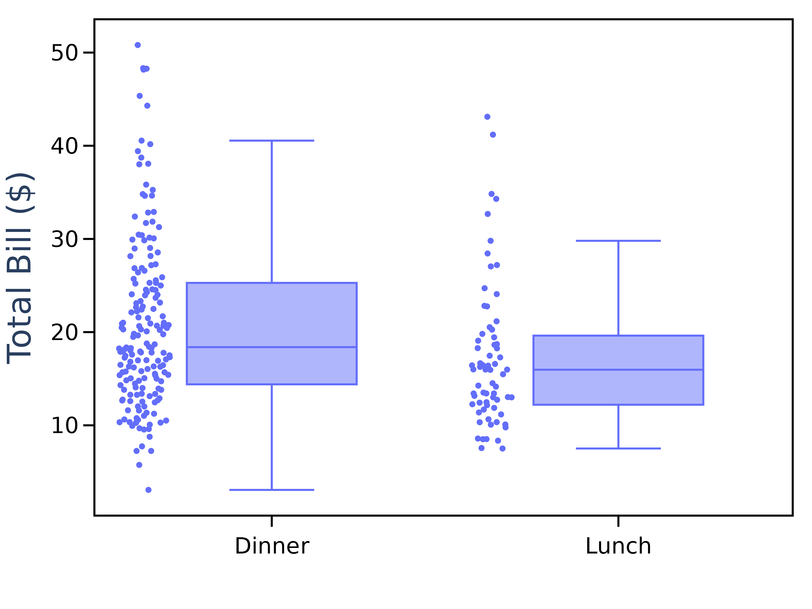
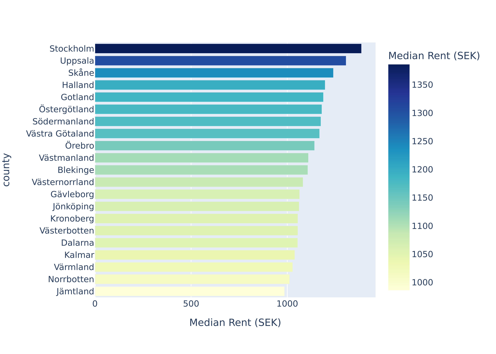
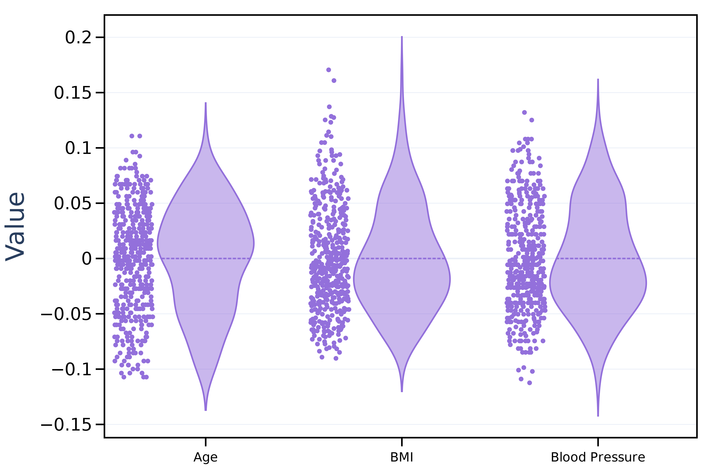
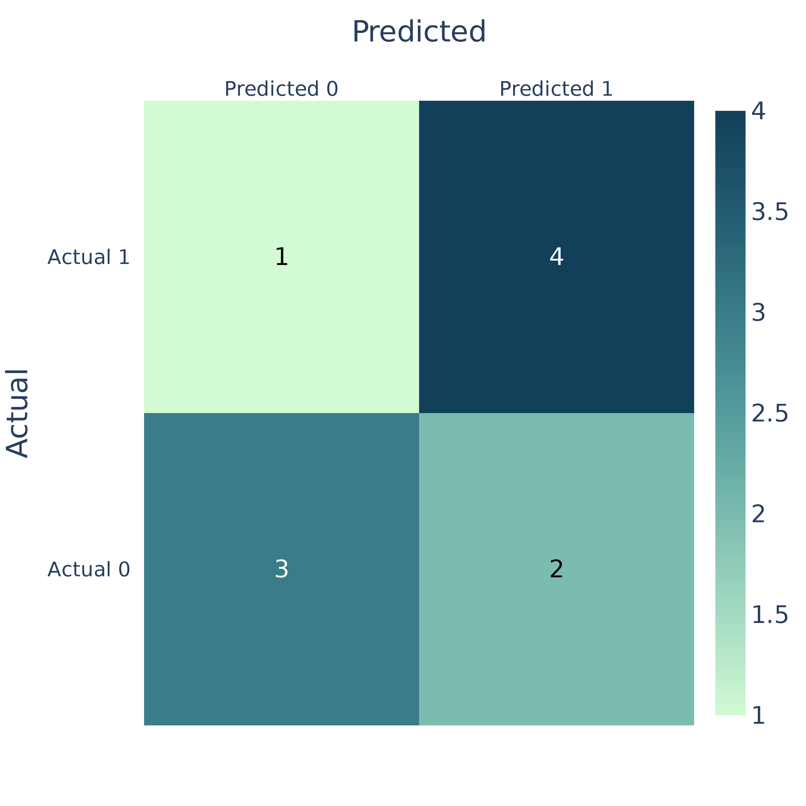

In this exercise you'll be challenged to remake some figures. You're provided with data you need to make these figures but how you do it and what graphing library you use is up to you. 

In cases where you deem appropriate try also to improve the quality of the figure. 

You can write your solutions in a jupyter notebook or as a regular .py file. 

Tip: Don't worry about things like matching the font exactly. Try to use a nice consistent style and use the features from the graph 


### Figure 1: 


<details markdown="1">
 <summary>Tip - click on me for a hint</summary>
TODO 
</details>


<details markdown="1">
 <summary>Solution - click on me for an example solution</summary>
TODO
</details>

---

### Figure 2: 



To download the data needed:

```
import plotly.express as px
df = px.data.tips()
```


<details markdown="1">
 <summary>Tip - click on me for a hint</summary>
This is a box plot. To show the scatter points alongside the box plot you can use the points `argument` in Plotly.
</details>


<details markdown="1">
 <summary>Solution - click on me for an example solution</summary>

```
import plotly.express as px
import plotly.io as pio # used to save the image 

df = px.data.tips()

fig = px.box(df, x="time", y="total_bill", points="all")
fig.update_layout(
    template="plotly_white",
    xaxis=dict(title="", titlefont=dict(size=32)),
    yaxis=dict(title="Total Bill ($)", titlefont=dict(size=32)),
    margin=dict(l=20, r=20, t=20, b=20),
    font_family="Arial",
    width=800,
    height=600,
)

fig.update_xaxes(showgrid=False, showline=True, linewidth=2, linecolor='black', mirror=True,
                 ticks="outside", tickwidth=2, tickcolor='black', ticklen=10,
                 tickfont=dict(color='black', size=22))
fig.update_yaxes(showgrid=False, showline=True, linewidth=2, linecolor='black', mirror=True,
                 ticks="outside", tickwidth=2, tickcolor='black', ticklen=10,
                 tickfont=dict(color='black', size=22))

fig.show()
pio.write_image(fig, r"../docs/assets/day4/replicate_fig_2.png", scale=6)
```

</details>

---

### Figure 3: 



To download the data needed:

```
import pandas as pd

df_url = r"https://raw.githubusercontent.com/RMCrean/practical-python-for-scientists/master/docs/assets/day4/county_bar_chart.csv"
df = pd.read_csv(df_url)
```


<details markdown="1">
 <summary>Tip - click on me for a hint</summary>
This is a horizontal bar chart with a "ylgnbu" yellow, green blue continuous colour scale. 
</details>


<details markdown="1">
 <summary>Solution - click on me for an example solution</summary>

```
import plotly.express as px
import plotly.io as pio  # used to save the image 

fig = px.bar(df, x="Median Rent (SEK)", y="county", orientation="h",
             color="Median Rent (SEK)", color_continuous_scale="ylgnbu")
fig.show()
pio.write_image(fig, r"../docs/assets/day4/replicate_fig_3.png", scale=6)
```
</details>


**Bonus:** 
- Improve the fonts sizes used. 
- Use a white background, 
- Add a line to show the median value. 
- Does the y-axis need to start from 0 SEK?

---

### Figure 4: 



To download the data needed:

```
from sklearn.datasets import load_diabetes
diabetes_data = load_diabetes(as_frame=True)
df = diabetes_data["data"]
```


<details markdown="1">
 <summary>Tip - click on me for a hint</summary>
The plot type is a violin plot. To link the column names to the names we use on the x-axis we could use a dictionary:

```
columns_to_use = {"Age": "age", "BMI": "bmi", "Blood Pressure": "bp"}
```

</details>


<details markdown="1">
 <summary>Solution - click on me for an example solution</summary>

```
import plotly.graph_objects as go
import plotly.io as pio  # used to save the image 

columns_to_use = {"Age": "age", "BMI": "bmi", "Blood Pressure": "bp"}


# create the figure object and add each column to it. 
fig = go.Figure()

for y_name, y_index in columns_to_use.items():
    fig.add_trace(
        go.Violin(
            y=df[y_index],
            line_color="mediumpurple",
            legendgroup=y_name, name=y_name,
            ),
    )

# update characteristics shared by all traces
fig.update_traces(meanline_visible=True,
                  points="all", # show all points
                  jitter=0.40,  # add some jitter on points for better visibility
)

fig.update_layout(
    template="plotly_white",
    yaxis= dict(title="Value", titlefont=dict(size=32)),
    margin=dict(l=20, r=20, t=20, b=20),
    showlegend=False,
    font_family="Arial",
    width=900,
    height=600,
)

fig.update_xaxes(showline=True, linewidth=2, linecolor='black', mirror=True,
                 ticks="outside", tickwidth=2, tickcolor='black', ticklen=10,
                 tickfont=dict(color='black', size=16))
fig.update_yaxes(showline=True, linewidth=2, linecolor='black', mirror=True,
                 ticks="outside", tickwidth=2, tickcolor='black', ticklen=10,
                 tickfont=dict(color='black', size=22))
fig.show()
pio.write_image(fig, r"../docs/assets/day4/replicate_fig_4.png", scale=6)
```

</details>

**Bonus:** Assign a unique colour to each graph.  


---

### Figure 5: Confusion Matrix



To download the data needed:

```
actual_values = [1, 0, 1, 1, 0, 1, 0, 0, 1, 0]
predicted_values = [1, 0, 1, 0, 0, 1, 1, 0, 1, 1]
```


<details markdown="1">
 <summary>Tip - click on me for a hint</summary>
Convert the above predictions and actual values in to a confusion matrix of shape 2 x 2.
</details>


<details markdown="1">
 <summary>Solution - click on me for an example solution</summary>

```
import plotly.figure_factory as ff
import plotly.io as pio  # used to save the image

# Create a confusion matrix
conf_matrix = [[0, 0], [0, 0]]  
for actual, predicted in zip(actual_values, predicted_values):
    conf_matrix[actual][predicted] += 1

fig = ff.create_annotated_heatmap(
    z=conf_matrix,
    x=['Predicted 0', 'Predicted 1'],
    y=['Actual 0', 'Actual 1'],
    colorscale="darkmint",
    showscale=True
)

fig.update_layout(
    xaxis=dict(title='Predicted', tickfont=dict(size=20)),
    yaxis=dict(title='Actual', tickfont=dict(size=20)),
    coloraxis=dict(colorbar=dict(title='Count', tickfont=dict(size=20))),
    font=dict(family='Arial', size=24),
    height=800, width=800,
)

fig.show()
pio.write_image(fig, r"../docs/assets/day4/replicate_fig_5.png", scale=6)
```

</details>


